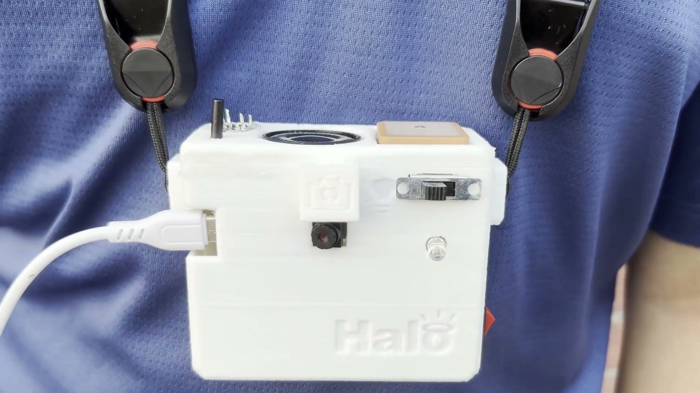
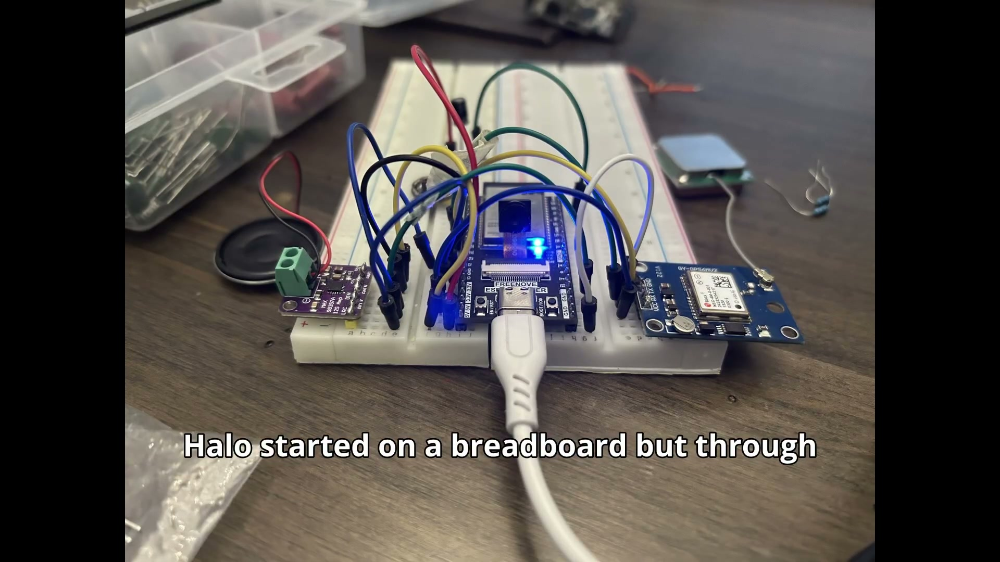
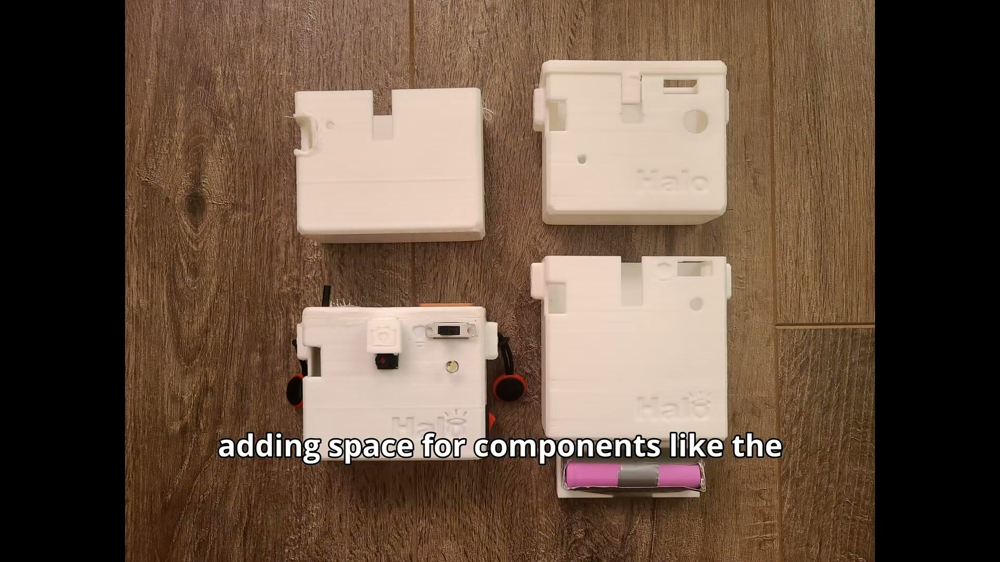

# Halo

🏆 1st Place, IEEE SSCS Arduino Contest 2025 (Post-Secondary)

▶️ [Meet Halo | IEEE SSCS Arduino Contest 2025](https://www.youtube.com/watch?v=oZpIQhcpVok)

Halo is a wearable smart assistant that helps people with vision loss navigate the world safely using live video, AI, and natural voice interaction. It detects hazards in real time, answers questions with contextual awareness, supports over 130 languages, and connects to a mobile companion app for alerts and settings.

Made by [Aayan Karmali](https://github.com/StockerMC) and [Jacob Tian](https://github.com/ilikecandy).

## Hardware

- ESP32-Wrover-E CAM board
- GY-NEO6MV2 GPS module
- INMP441 microphone
- MAX98357A speaker amplifier
- Push button for SOS/push-to-talk
- LED for areas with low light to assist with vision and Halo functionality
- Battery with power switch

## Software

- ESP32 firmware (this repo):
  - Live video analysis via the Gemini Live API over WebSockets
  - Speech-to-text and wake word detection via Deepgram
  - Multilingual text-to-speech via Deepgram, Google Cloud TTS, and Google Translate (130+ languages)
  - Navigation and place information via the Google Maps Platform
- [Halo-API](https://github.com/StockerMC/Halo-API): Vercel backend between the ESP32, Supabase (realtime alerts and preferences), and Firebase Cloud Messaging
- [Halo-App](https://github.com/StockerMC/Halo-App): companion app built with Expo and React Native for managing settings, reviewing alerts, and SOS notifications

## Design and prototyping

Halo went through five hardware iterations, from a breadboard prototype to a 3D-printed wearable with a neck strap. Improvements included a camera cover for privacy, better strap comfort, dedicated space for components and ports, and integrated battery housing.

 

There's an [interactive 3D model](https://p3d.in/jKlt1) of the case.
